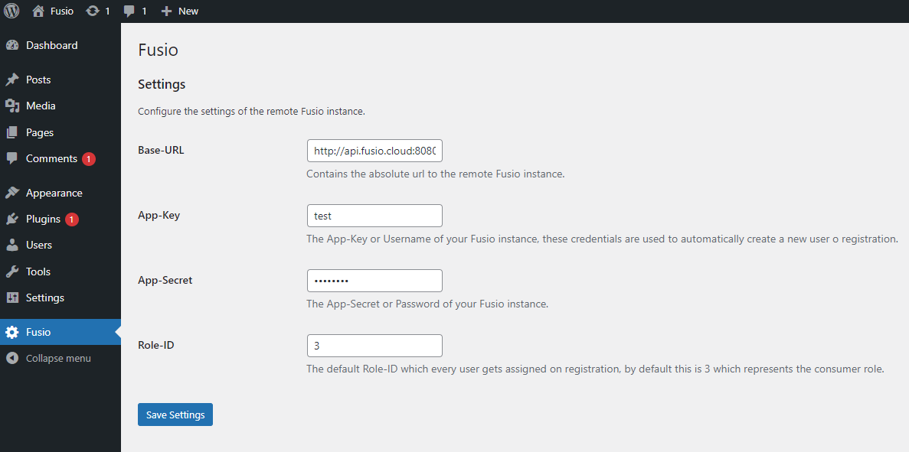

# Fusio SDK Wordpress

This repository contains a simple Wordpress-Plugin which helps to integrate Fusio
into Wordpress. This is useful in case you want that your Wordpress users can also
access APIs which you have build with Fusio. Fusio is an open source API management
system, more information at https://github.com/apioo/fusio

## Installation

To install this plugin you only have to copy the `fusio.php` file into the folder
`wp-content/plugins/fusio`. Then you can activate the plugin at the Wordpress backend.

## Configuration

After activate you should see "Fusio" under the navigation, there you can configure
the Fusio credentials s.

## Workflow

If everything is configured correctly the plugin will automatically create a user
on registration at the configured remote Fusio instance. If a user authenticates
we also obtain an access token for this user which we can be used to make further
calls against the internal Fusio API.
